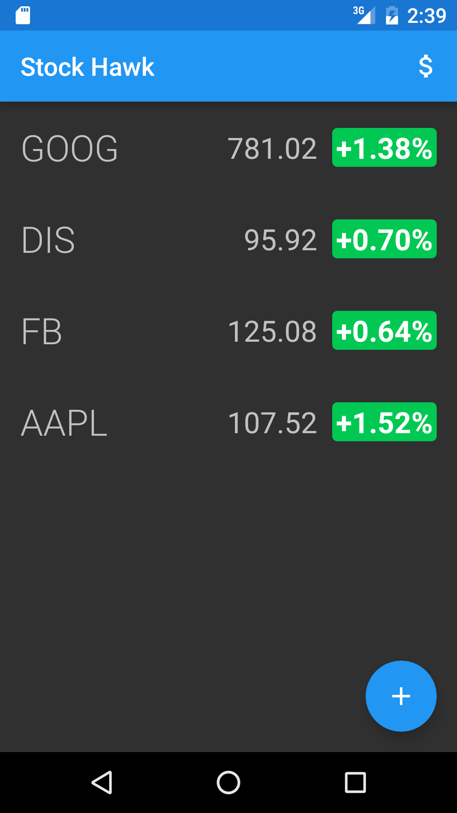
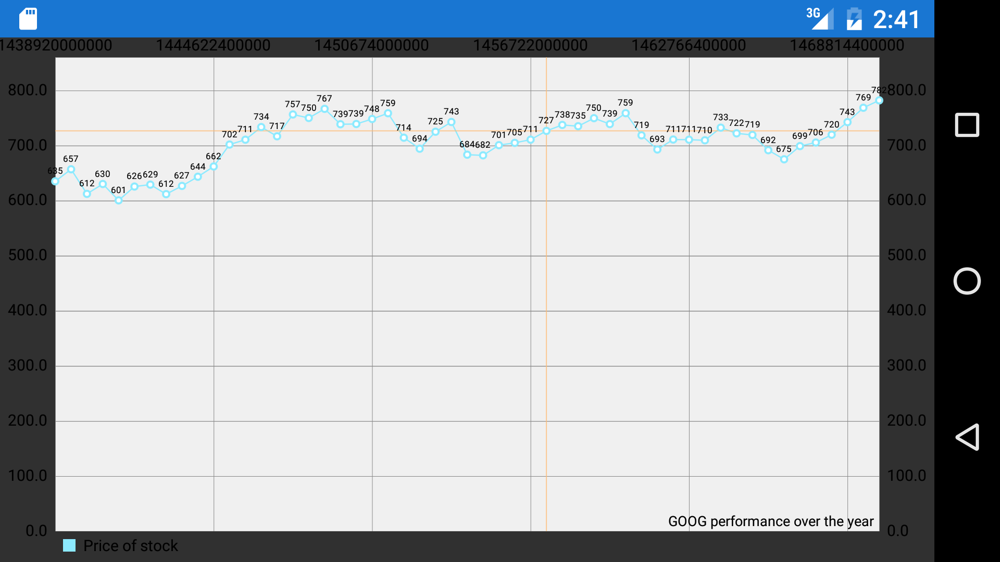

# Udacity-Project-3
##Stock Hawk

###Overview:

Udacity's Project 3 Stock Hawk is to improve upon their version of [Stock Hawk](https://github.com/udacity/StockHawk). The main goals were to add accessibilities, allow for right to left text formatting, graph data, and create a widget. I used the [Quotes API for Yahoo Finance](http://financequotes-api.com/) as well as [MPAndroidChart](https://github.com/PhilJay/MPAndroidChart) to graph the stock data.

##Screenshots:
 
 
 
